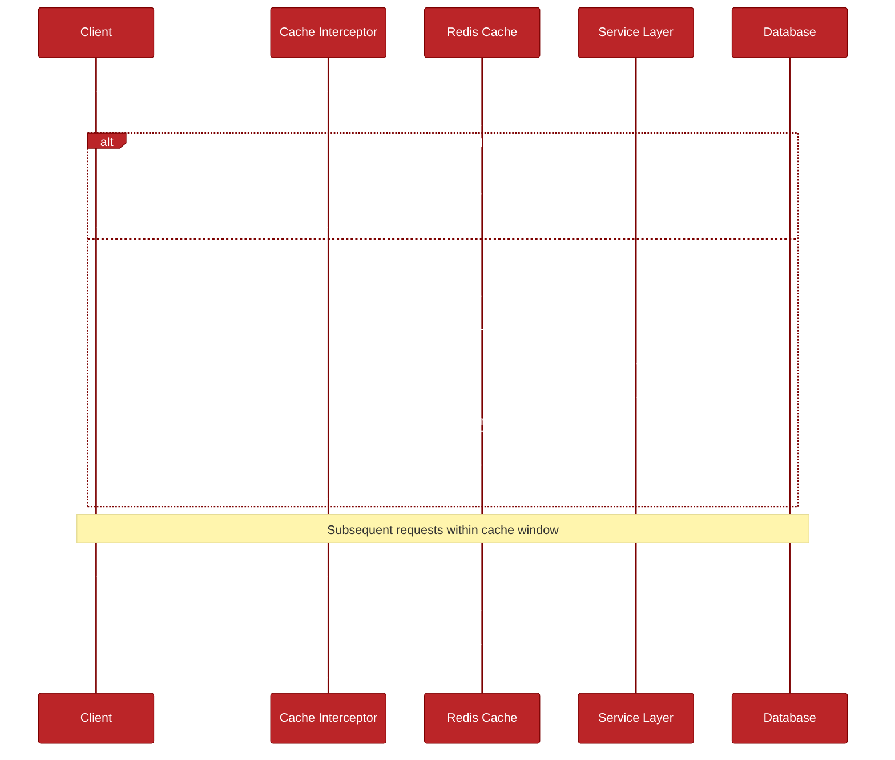

# MovieDirectorHub API

A robust and scalable backend solution for managing movies and directors, built with TypeScript, Node.js, and MongoDB.

## Table of Contents

- [System Architecture](#system-architecture)
- [Features](#features)
- [Tech Stack](#tech-stack)
- [Project Structure](#project-structure)
- [Getting Started](#getting-started)
- [API Documentation](#api-documentation)
- [API Data Formats and Validation](#api-data-formats-and-validation)
- [Error Handling](#error-handling)
- [Technology Choices and Comparisons](#technology-choices-and-comparisons)
- [Benchmarking](#benchmarking)
- [Pagination and Caching Strategy](#pagination-and-caching-strategy)
- [Future Potential Development Areas](#future-potential-development-areas)

## System Architecture

The application follows a modular monolithic architecture with clear separation of concerns:

### Layers

1. **Controllers**: Handle HTTP requests/responses
2. **Services**: Implement business logic
3. **Repositories**: Handle data access
4. **Models**: Define data structures and validation

### Design Patterns

- Repository Pattern
- Service Layer Pattern
- Dependency Injection
- Factory Pattern
- Singleton Pattern (for database connections)
- Pagination Pattern

### Key Principles

- SOLID and DRY principles
- Clean Architecture
- Type Safety
- Modular Design

## Features

- Complete CRUD operations for movies and directors
- Advanced search and filtering capabilities
- Pagination and sorting
- Data validation using Zod
- Caching with Redis
- Rate limiting
- API documentation with Swagger
- Error handling and logging
- Security features (CORS, Helmet)

## Tech Stack

- **Runtime**: Node.js with TypeScript
- **Web Framework**: Express.js
- **Database**: MongoDB with Mongoose ODM
- **Caching**: Redis
- **Validation**: Zod
- **Documentation**: Swagger/OpenAPI
- **Testing**: Jest (planned)
- **Logging**: Winston
- **Security**: 
  - Helmet
  - CORS
  - Rate Limiting
  - Input Validation

## Project Structure

```
src/
├── config/                 # Configuration files
├── modules/               # Feature modules
│   ├── movie/            # Movie module
│   │   ├── controllers/
│   │   ├── services/
│   │   ├── repositories/
│   │   ├── models/
│   │   └── routes/
│   ├── director/         # Director module
│   │   ├── controllers/
│   │   ├── services/
│   │   ├── repositories/
│   │   ├── models/
│   │   └── routes/
│   └── shared/           # Shared module
│   │   └── interceptors/
│   │   └── repositories/ # mongodb
│   │   └── schemas/
│   │   └── services/ # for redis 
│   │   └── types/
│   │   └── utils/
├── middleware/           # Application middleware
├── utils/               # Global error management
├── app.ts              # Application entry point
├── Dockerfile
└── Docker Compose
```

## Getting Started

### Prerequisites

- Docker and Docker Compose
- Git

### Quick Start (One Command Setup)

1. Clone the repository:
```bash
git clone https://github.com/MelihCelik00/MovieDirectorHub.git
cd MovieDirectorHub
```

2. Start the entire application:
```bash
docker-compose up --build
```

3. Additionally, if you want to restart the app:
```bash
docker-compose down && docker-compose up --build
```

That's it! The following services will be automatically set up and available:
- API: http://localhost:3000
- API Documentation: http://localhost:3000/api-docs
- MongoDB Express (Database UI): http://localhost:8081
  - Username: admin
  - Password: password123

The setup includes:
- Application build and startup
- Database initialization with sample data
- Redis cache setup
- Health checks for all services
- Automatic service dependency management

### Development Mode

For development with hot-reload:
```bash
docker-compose -f docker-compose.yml -f docker-compose.dev.yml up --build
```

### Useful Commands

View logs:
```bash
# All services
docker-compose logs -f

# Specific service
docker-compose logs -f app
```

Execute commands in containers:
```bash
# Access app container shell
docker-compose exec app sh

# Run tests
docker-compose exec app npm test

# Install new dependencies
docker-compose exec app npm install <package-name>
```

Stop the application:
```bash
# Stop and remove containers
docker-compose down

# Stop and remove containers, volumes, and images
docker-compose down -v --rmi all
```

### Service Health Checks

The setup even includes health checks for all services:
- API: http://localhost:3000/api/health
- MongoDB: Internal ping command
- Redis: Internal ping command
- Mongo Express: HTTP check

## API Documentation

### Director Endpoints

- **GET ```/api/directors```**
  - Get all directors with pagination
  - Query params: page, limit, sortBy, sortOrder

- **GET ```/api/directors/:id```**
  - Get director by ID

- **POST ```/api/directors```**
  - Create a new director
  - Required fields: firstName, lastName, birthDate

- **PUT ```/api/directors/:id```**
  - Update director by ID

- **DELETE ```/api/directors/:id```**
  - Delete director by ID

- **GET ```/api/directors/search/date-range```**
  - Search directors by birth date range
  - Query params: startDate, endDate

- **GET ```/api/directors/search/name```**
  - Search director by name
  - Query params: firstName, lastName

### Movie Endpoints

- **GET ```/api/movies```**
  - Get all movies with pagination
  - Query params: page, limit, sortBy, sortOrder

- **GET ```/api/movies/:id```**
  - Get movie by ID

- **POST ```/api/movies```**
  - Create a new movie
  - Required fields: title, description, releaseDate, genre, imdbId, directorId

- **PUT ```/api/movies/:id```**
  - Update movie by ID

- **DELETE ```/api/movies/:id```**
  - Delete movie by ID

- **GET ```/api/movies/director/:directorId```**
  - Get movies by director ID

- **GET ```/api/movies/imdb/:imdbId```**
  - Get movie by IMDB ID

- **GET ```/api/movies/search/genre```**
  - Search movies by genre
  - Query params: genre

- **GET ```/api/movies/search/release-year```**
  - Search movies by release year range
  - Query params: startYear, endYear

- **GET ```/api/movies/search/rating```**
  - Search movies by rating range
  - Query params: minRating, maxRating

## API Data Formats and Validation

### Movies

#### Date Formats
The API accepts multiple date formats for the `releaseDate` field:
- YYYY-MM-DD (e.g., "2017-12-01")
- ISO 8601 (e.g., "2017-12-01T00:00:00.000Z")
- Date objects

#### Rating
- Accepts both number and string formats (e.g., 7.4 or "7.4")
- Must be between 0 and 10
- Optional field

#### IMDB ID
- Must start with "tt" followed by 7-8 digits (e.g., "tt4925292")
- If "tt" prefix is missing, it will be automatically added
- Must be unique across all movies

#### Other Fields
- `title`: Required, 1-200 characters
- `description`: Required, 1-2000 characters
- `genre`: Required, 1-50 characters
- `directorId`: Required, must be a valid MongoDB ObjectId

### Directors

#### Date Formats
The API accepts multiple date formats for the `birthDate` field:
- YYYY-MM-DD (e.g., "1970-07-30")
- ISO 8601 (e.g., "1970-07-30T00:00:00.000Z")

#### Required Fields
- `firstName`: 1-50 characters
- `lastName`: 1-50 characters
- `birthDate`: Valid date in accepted formats

#### Optional Fields
- `bio`: String, up to 2000 characters

### Search Endpoints

#### Movies
- Search by genre: `/api/movies/search/genre?genre=Drama`
- Search by rating range: `/api/movies/search/rating?min=7.0&max=10.0`
- Search by release date range: `/api/movies/search/release-date?from=2000-01-01&to=2020-01-01`
- Search by IMDB ID: `/api/movies/imdb/:imdbId`
- Search by director: `/api/movies/director/:directorId`

#### Directors
- Search by name: `/api/directors/search?firstName=Christopher&lastName=Nolan`
- Search by birth date range: `/api/directors/search/date-range?from=1960-01-01&to=1980-01-01`

### Dependencies
The application uses:
- Zod for runtime type checking and validation
- MongoDB for data persistence
- Express for the REST API

### Validation and Error Handling

The API implements robust validation using Zod schema validation:

#### Input Validation
- All inputs are validated before processing
- Automatic type coercion where appropriate (e.g., string to number for ratings)
- Format validation for special fields (IMDB ID, dates, ObjectIds)
- Cross-reference validation (e.g., checking if director exists)

#### Error Responses
The API provides detailed error messages in a consistent format:
```json
{
  "status": "error",
  "code": 400,
  "message": "Validation failed: [field]: [specific error message]",
  "timestamp": "2025-01-19T14:31:08.204Z",
  "path": "/api/endpoint"
}
```

#### Validation Features
- Automatic data transformation (e.g., adding "tt" prefix to IMDB IDs)
- Multiple format support for dates
- Flexible input formats (e.g., numbers as strings)
- Detailed error messages for each validation failure
- Required vs optional field validation
- Range and format validation for specific fields

## Error Handling

The application has global error management:

### Error Types

- **ValidationError** (400): Invalid input data
- **NotFoundError** (404): Resource not found
- **ConflictError** (409): Resource conflict
- **DatabaseError** (500): Database operation errors

### Error Response Format

```json
{
  "status": "error",
  "code": 400,
  "message": "Validation failed",
  "timestamp": "2024-01-19T12:00:00.000Z",
  "path": "/api/movies",
  "details": {}
}
```
---------
**What you will find below are the challenges faced during the project, researched benchmarkings, performance efficient strategies.**

-------------
## Architectural Decision: Monolithic vs Microservices

This project implements a modular monolithic architecture instead of microservices. Here's the reasoning behind this decision:
>  Note: I tried to implement microservice architecture at first but then changed all planning and migrated to a monolithic structure. You can find my non-finished implementations at related microservice branch.

### Why Modular Monolith?

1. **Project Scale**
   - The current scope (movies and directors) doesn't justify the operational complexity of microservices
   - Domain boundaries are clear but closely related
   - Data consistency is crucial between movies and directors

2. **Development Efficiency**
   - Faster development and deployment cycles (important for efficient and agile teams)
   - Simpler debugging and testing
   - Easier to maintain code consistency
   - Lower initial development overhead

3. **Operational Simplicity**
   - Single deployment unit
   - Simpler monitoring and logging
   - Less infrastructure complexity
   - Lower operational costs in a production environment case

4. **Team Size**
   - Suitable for small to medium-sized teams
   - No need for multiple specialized teams
   - Easier knowledge sharing and onboarding

### Future Scalability Considerations

The current modular design allows for future migration to microservices if needed:

1. **Module Independence**
   - Clear boundaries between modules
   - Separate business logic and data access layers
   - Independent scaling possible through containerization

2. **Migration Path**
   - Modules can be extracted into microservices gradually
   - Event-driven patterns can be introduced incrementally
   - Service discovery and API gateway can be added when needed
   - Messaging technologies like Kafka or RabbitMQ can be used if needed 

### Trade-offs Analysis

#### Advantages of Current Approach

1. **Simplicity**
   - Single codebase
   - Unified deployment
   - Direct method calls instead of network calls
   - Simpler testing and debugging

2. **Performance**
   - No network overhead between modules
   - Shared resources (cache, database connections)
     - Detailed caching strategies are explained below
   - Lower latency for cross-module operations

3. **Consistency**
   - Strong consistency for related data
   - Simpler transaction management
   - Unified schema updates

4. **Resource Efficiency**
   - Lower infrastructure costs (potential, currently not the case)
   - Fewer moving parts
   - Simplified monitoring
     - I didn't use but monitoring technologies can be integrated.

#### What We Give Up

1. **Independent Scaling**
   - Cannot scale modules independently
   - Resource allocation is shared

2. **Technology Diversity**
   - Locked into single technology stack
   - Cannot optimize different modules with different technologies

3. **Isolation**
   - Bugs can potentially affect the entire system
   - Deployments require full system updates

#### When to Consider Microservices

The project is designed to evolve into microservices when:

1. **Scale Indicators**
   - High load on specific modules
   - Need for independent scaling
   - Different resource requirements per module

2. **Team Growth**
   - Multiple teams working on different modules
   - Need for independent deployment cycles
   - Specialized technology requirements

3. **Business Requirements**
   - Different availability requirements per module
   - Need for different security levels
   - Geographic distribution requirements

This architectural decision prioritizes development speed, simplicity, and maintainability while keeping the door open for future evolution as the project grows.


## Technology Choices and Comparisons

### Validation: Zod vs Alternatives

#### Why Zod over Joi or Yup?
- **Type Safety**: Zod provides first-class TypeScript support with automatic type inference
- **Performance**: Smaller bundle size and better runtime performance
- **Schema Inference**: Automatic type generation from schemas
- **Transformations**: Built-in data transformation with type safety
- **Error Handling**: More detailed and structured error messages

Comparison:
```
Package | Bundle Size  | Type Safety | Performance
--------|--------------|-------------|------------
Zod     | ~15.9kB     | Excellent   | Very Good
Joi     | ~88.5kB     | Limited     | Good
Yup     | ~44.7kB     | Good        | Good
```

### ODM: Mongoose vs Alternatives

> **Note**: Mongoose was a requirement specified in the case study. However, it's worth comparing it with alternatives to understand its strengths and potential areas for improvement in future projects.

#### Why Mongoose over Prisma or TypeORM?
- **Maturity**: Battle-tested with MongoDB
- **Flexibility**: Better support for dynamic schemas
- **Middleware**: Rich middleware ecosystem
- **Query API**: Intuitive MongoDB-like query interface
- **Community**: Large community and extensive plugins
- **Case Study Requirement**: Specified as the required ODM for this project

Comparison:
```
Feature          | Mongoose | Prisma  | TypeORM
-----------------|----------|---------|----------
MongoDB Support  | Native   | Limited | Limited
Schema Flexibility| High    | Low     | Medium
Learning Curve   | Medium   | High    | High
Query Performance| Good     | Better  | Good
Type Safety      | Good     | Better  | Better
```

While Prisma and TypeORM offer some advantages in terms of type safety and query performance, Mongoose was the perfect fit for this case study due to its native MongoDB support and alignment with the project requirements.

### Caching: Redis vs Alternatives

#### Why Redis over Memcached or Node-Cache?
- **Data Types**: Rich data structure support
- **Persistence**: Optional disk persistence
- **Pub/Sub**: Built-in publish/subscribe
- **Scalability**: Cluster support
- **Performance**: Excellent performance characteristics

Comparison:
```
Feature      | Redis    | Memcached | Node-Cache
-------------|----------|-----------|------------
Performance  | Excellent| Excellent | Good
Data Types   | Many     | Basic     | Basic
Persistence  | Yes      | No        | No
Memory Usage | Moderate | Low       | High
Scalability  | High     | Medium    | Low
```


## Pagination and Caching Strategy

### Overview
The application implements a robust caching strategy using Redis, with an interceptor pattern for transparent caching of paginated results. This approach ensures efficient data retrieval while maintaining clean separation of concerns.

### Architecture
- **Cache Interceptor**: Implements a singleton pattern to manage all caching operations
- **Middleware Layer**: Provides three key middleware functions:
  - `cachePagination`: Intercepts pagination requests and serves cached data if available
  - `cacheResponse`: Caches response data for future requests
  - `invalidateEntityCache`: Handles cache invalidation for specific entity types after mutations

### Implementation Details
1. **Batch Caching**
   - Caches 100 records at a time (configurable via `CACHE_BATCH_SIZE`)
   - Subsequent requests for different pages within this range are served from cache
   - Cache entries expire after 5 minutes (configurable TTL)

2. **Cache Keys**
   - Format: `${entityType}:${sortBy}:${sortOrder}`
   - Example: `movies:releaseDate:desc`
   - Ensures unique caching based on entity type and sort parameters

3. **Cache Invalidation**
   - Automatic invalidation on CREATE/UPDATE/DELETE operations
   - Entity-specific invalidation to prevent unnecessary cache clearing
   - Handled transparently through middleware

### Usage in Routes
```typescript
// Example route with caching
router.get('/', cachePagination, cacheResponse, wrapRoute(controller.getAllMovies));

// Example route with cache invalidation
router.post('/', invalidateEntityCache('movies'), wrapRoute(controller.createMovie));
```

### Benefits
1. **Separation of Concerns**
   - Business logic remains clean in services
   - Caching logic is centralized in the interceptor
   - Routes define caching behavior declaratively

2. **Performance**
   - Reduced database load
   - Faster response times for cached data
   - Efficient batch caching strategy

3. **Maintainability**
   - Easy to modify caching behavior globally
   - Simple to add caching to new routes
   - Clear cache invalidation patterns

4. **Flexibility**
   - Configurable cache sizes and TTL
   - Easy to extend for different caching requirements
   - Simple to disable caching for specific routes

### Example GET Request Flow



1. Client requests `/api/movies?page=2&limit=10`
2. Cache interceptor checks for cached data
3. If cached, returns data from cache
4. If not cached, fetches from database and caches result
5. Subsequent requests within cache window are served from cache

### Cache Invalidation Flow
1. Client sends POST/PUT/DELETE request
2. `invalidateEntityCache` middleware triggers
3. Cache for specific entity type is marked as invalid
4. Next GET request will fetch fresh data

My key intention here for the caching strategy is providing an optimal balance between performance and data consistency while ensuring clean code architecture through the interceptor pattern.

## Future Potential Development Areas

1. **Authentication & Authorization**
   - JWT-based authentication
   - Role-based access control
   - OAuth2 integration, etc.

2. **Testing**
   - Unit tests
   - Integration tests
   - E2E tests
   - Test coverage reporting

3. **Performance Optimizations**
   - Query optimization
   - Index optimization (Unique, Compound)
   - Connection pooling

4. **Additional Business Features**
   - Movie ratings and reviews
   - Validating movies with IMDB apis
   - User favorites
   - Watchlists
   - Advanced search with full-text search
   - Image upload for movie posters
   - Batch operations

5. **Infrastructure**
   - CI/CD pipeline with test coverage, sonarqube stages
   - Monitoring and alerting
   - Performance metrics
   - Auto-scaling (might be handful in case of cloud provider usage)

6. **Documentation**
   - API versioning
   - Code documentation improvements